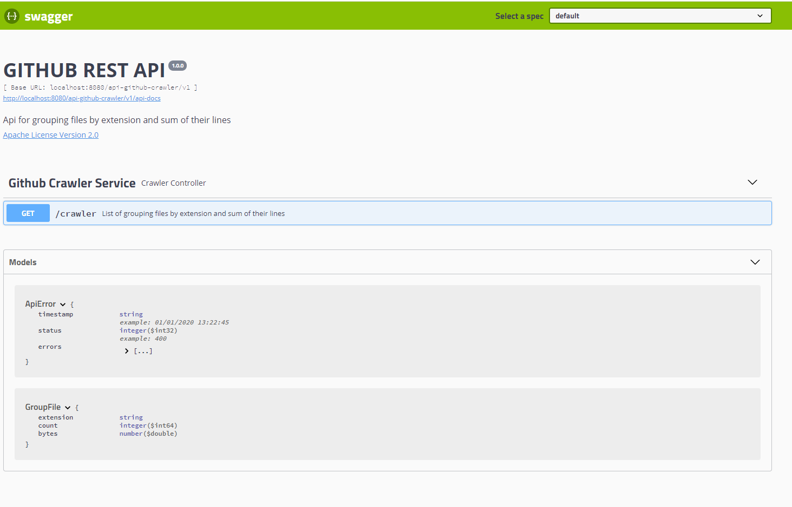

# Github Crawler Service



Api for grouping files by extension and sum of their lines

## Iniciando

### Pré-requisitos

Para o desenvolvimento serão necessários os seguintes software : 
* [JDK11](https://www.oracle.com/br/java/technologies/javase-jdk11-downloads.html) - Java SE Development Kit 11.
* [Apache Maven](https://maven.apache.org/) - Ferramenta de gerenciamento e compreensão de projetos de software.
* [git](https://git-scm.com/downloads) - Controle de versão.

#### Ambiente de desenvolvimento integrado (IDE)
Como o projeto utiliza o  [Apache Maven](https://maven.apache.org/) qualquer IDE que tenha integração pode ser utilizada

* [Eclipse](https://www.eclipse.org/) 
* [Netbeans](https://netbeans.org/) 


## Iniciando

Clonando o projeto:

```
git clone https://github.com/danielscpereira/github-crawler.git
```

## Importação do Projeto 

### Eclipse
	Com o Eclipse aberto siga os seguintes passos : 
	
		1. Clique em Arquivo> Importar.
		2. Digite Maven na caixa de pesquisa em Selecione uma fonte de importação:
		3. Selecione Projetos Maven Existentes.
		4. Clique em Next.
		5. Clique em Navegar e selecione a pasta que é a raiz do projeto Maven (provavelmente contém o arquivo pom.xml)
		6. Clique em Next.
		7. Clique em Concluir.

### Netbeans
	Com o Netbeans aberto siga os seguintes passos : 
	
		1. Clique em Arquivo>  Abrir Projeto..
		2. Navege ate a pasta raiz do projeto.
		3. Clique em abrir projeto.
		
### Arquivos de configuração do projeto

Todas as configurações do projeto estão nos arquivos [application.properties](./application.properties).


## Testando a aplicação 

Para rodar a aplicação utilizando o [Springboot](https://spring.io/projects/spring-boot) e o Maven

```
mvn clean package spring-boot:run
```

#### Acessando a aplicação Local 

Após a publicação da aplicação no servidor acesse : **http://localhost:8080/api-github-crawler/v1**


## Conteinerização da aplicação 

```
mvn compile jib:dockerBuild
```

##### Envio da imagem para o registry
``` 
 docker push registry.heroku.com/github-crawler-ds/web:latest
```

##### Deploy da aplicação
``` 
 heroku container:release web -a github-crawler-ds
```

#### Acessando a aplicação remota 

Após a publicação da aplicação no servidor acesse : **https://github-crawler-ds.herokuapp.com/api-github-crawler/v1**


## Autor

* **Daniel Santiago do Carmo Pereira** - (http://www.linkedin.com/in/danielscpereira)

